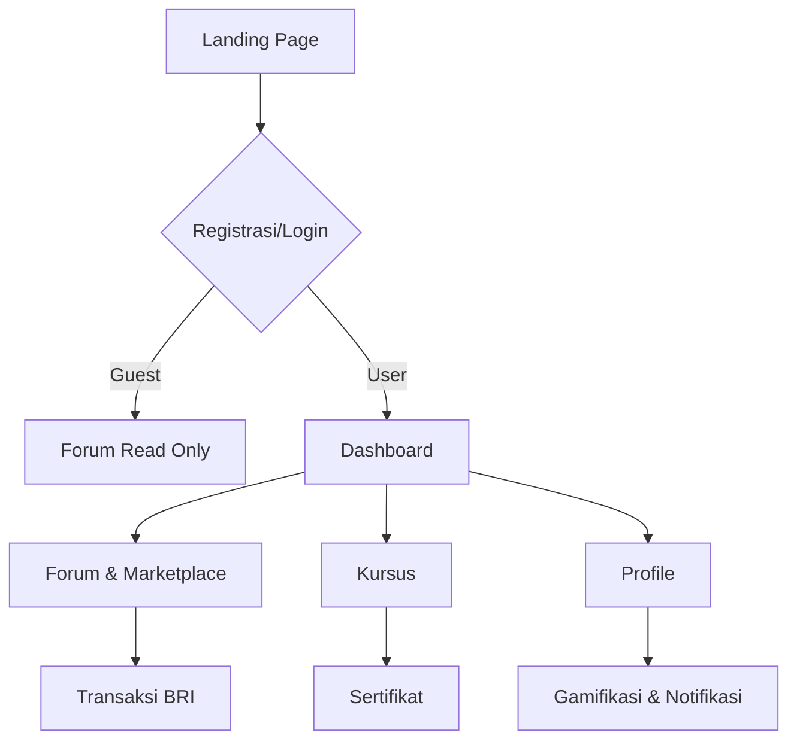

## PRD Global - SensasiWangi.id

### 1. Latar Belakang
SensasiWangi.id adalah platform terpadu untuk komunitas pecinta parfum Indonesia. Produk ini menggabungkan forum diskusi, marketplace, dan platform kursus untuk memenuhi kebutuhan hobi dan profesional.

### 2. Tujuan
1. Menyediakan wadah diskusi dan kolaborasi bagi penggemar serta pembuat parfum.
2. Menjadi pusat edukasi parfum berbahasa Indonesia yang komprehensif.
3. Memfasilitasi transaksi jual beli parfum dan bahan baku secara aman.
4. Meningkatkan keterlibatan komunitas melalui gamifikasi dan notifikasi real-time.

### 3. Fitur Utama
- Landing page informatif dengan keunggulan platform.
- Onboarding lengkap dengan pilihan peran (penikmat vs pembuat).
- Forum komunitas dengan sistem reputasi, moderasi, dan advanced search.
- Marketplace dengan integrasi pembayaran BRI (VA & QRIS).
- Platform kursus dengan progress tracking, catatan, dan sertifikat.
- Profil pengguna dengan level, badge, dan leaderboard.
- Sistem notifikasi dan pesan pribadi.
- Panel admin untuk manajemen user dan transaksi.
- Dukungan mobile dan offline melalui service worker.
- Integrasi Cloudinary untuk media dan React Email untuk notifikasi.

### 4. User Flow

### 5. Requirements
**Functional**
- Role-based access untuk guest, user, business, dan admin.
- Pembuatan dan moderasi konten forum.
- Listing produk, keranjang, dan pembayaran BRI.
- Pembelian dan progres kursus.
- Pengaturan profil dan preferensi notifikasi.
- Panel admin untuk laporan dan manajemen.

**Non-functional**
- Respon halaman < 2 detik.
- Skalabilitas 1000+ pengguna bersamaan.
- Enkripsi data sensitif dan compliance regulasi.

### 6. Metrik Sukses
- Jumlah thread dan transaksi per bulan.
- Tingkat penyelesaian kursus.
- Retensi pengguna bulanan.
- Pendapatan marketplace.
- Skor kepuasan pengguna.
