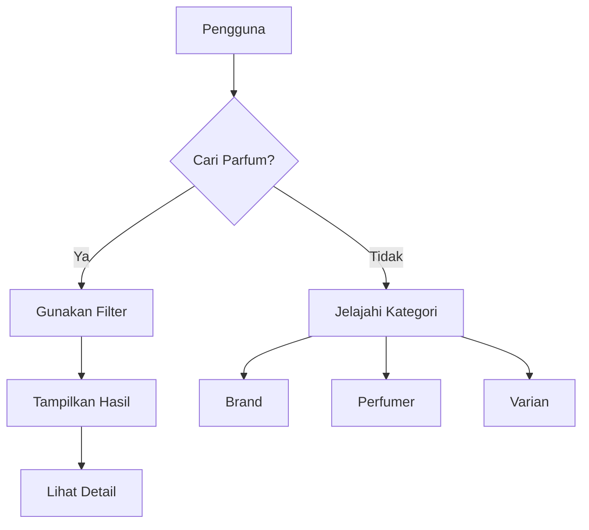

## Modul DATABASE

### 1. Latar Belakang
Pusat data terstruktur untuk merekam seluruh informasi tentang brand parfum lokal Indonesia, perfumer, dan varian produk. Database ini menjadi fondasi untuk fitur rekomendasi, pencarian, dan manajemen produk di platform.

### 2. Tujuan
1. Mengumpulkan data 100+ brand parfum lokal dalam 3 bulan
2. Membangun katalog 500+ varian parfum terlengkap
3. Memastikan akurasi data 95% melalui sistem verifikasi komunitas

### 3. Fitur Utama
- Katalog brand parfum lokal
- Profil perfumer (nose) Indonesia
- Detail varian parfum (notes, konsentrasi, keluarga aroma)
- Sistem tagging dan klasifikasi aroma
- Pencarian multi-kriteria (notes, brand, kategori)
- Umpan data untuk sistem rekomendasi

### 4. User Flow

### 5. Requirements
**Functional:**
- Skema data terstruktur untuk brand, perfumer, varian
- Sistem verifikasi konten crowdsourced
- Integrasi dengan modul marketplace dan kursus
- API untuk akses terkelola

**Non-functional:**
- Replikasi data real-time
- Backup harian
- Response time < 1 detik untuk query

### 6. Metrik Sukses
- Jumlah entri brand/varian
- Tingkat akurasi data
- Penggunaan API (jumlah request)
- Waktu respon kueri rata-rata