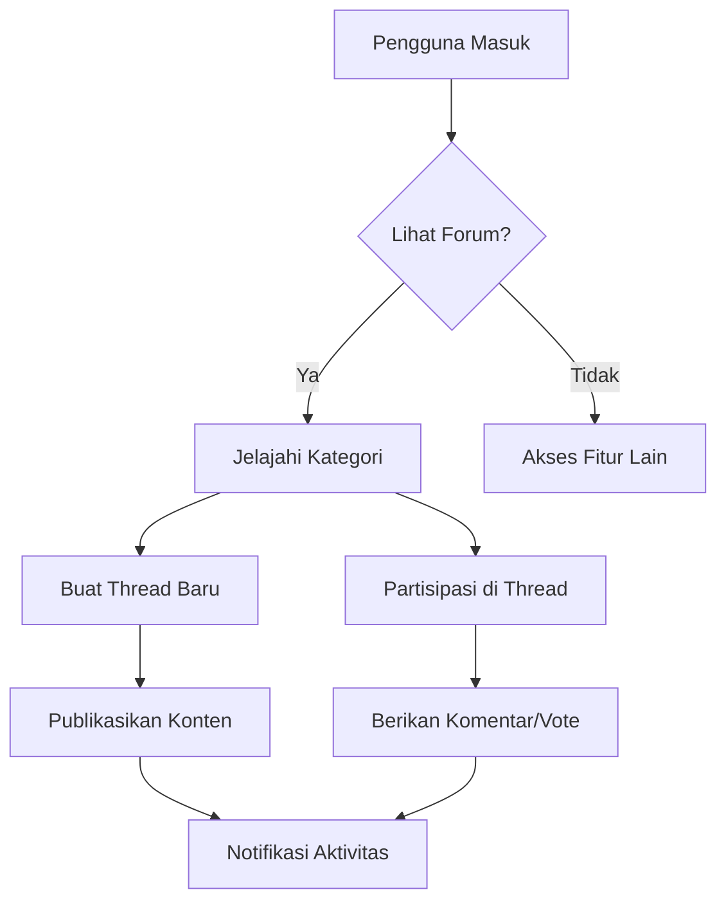

## Modul FORUM

### 1. Latar Belakang
Platform diskusi komunitas untuk berbagi pengetahuan dan pengalaman terkait produk dan layanan. Memfasilitasi interaksi antar pengguna dan membangun komunitas yang aktif.

### 2. Tujuan
1. Meningkatkan engagement pengguna sebesar 40% dalam 3 bulan
2. Memfasilitasi rata-rata 5 thread baru per hari
3. Mengurangi pertanyaan berulang ke customer service sebesar 30%

### 3. Fitur Utama
- Buat thread diskusi baru
- Komentar dan balas thread
- Vote sistem (upvote/downvote)
- Kategorisasi konten
- Pencarian thread
- Sistem reputasi pengguna

### 4. User Flow

### 5. Requirements
**Functional:**
- Autentikasi pengguna wajib untuk kontribusi
- Moderasi konten otomatis dan manual
- Sistem notifikasi real-time
- Pencarian full-text

**Non-functional:**
- Waktu respon < 2 detik
- Kapasitas 1000+ pengguna bersamaan
- Enkripsi end-to-end untuk data pribadi

### 6. Metrik Sukses
- Jumlah thread aktif per hari
- Rasio engagement (komentar/pengunjung)
- Waktu rata-rata di halaman forum
- Tingkat retensi pengguna forum