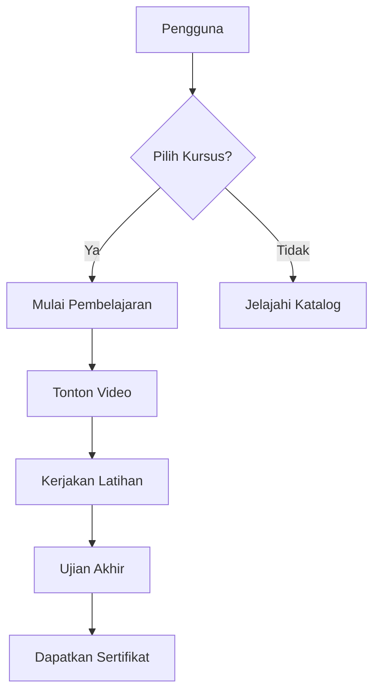

## Modul KURSUS

### 1. Latar Belakang
Platform pembelajaran online dengan konten terstruktur untuk pengembangan skill dan sertifikasi profesional.

### 2. Tujuan
1. Menyediakan 50+ kursus dalam 3 bulan
2. Mencapai 70% penyelesaian kursus
3. Mendapatkan rating rata-rata 4.7/5

### 3. Fitur Utama
- Katalog kursus terstruktur
- Progress tracking
- Video pembelajaran
- Kuis dan evaluasi
- Sertifikat kelulusan
- Forum diskusi khusus kursus

### 4. User Flow

### 5. Requirements
**Functional:**
- Manajemen konten kursus
- Video streaming adaptif
- Sistem penilaian otomatis
- Pembelajaran berbasis kompetensi

**Non-functional:**
- CDN untuk konten video
- Transkripsi otomatis
- Integrasi LTI untuk standar pendidikan

### 6. Metrik Sukses
- Tingkat penyelesaian kursus
- Nilai rata-rata peserta
- Kepuasan pembelajaran (survey)
- Rasio rekomendasi kursus

### 7. Modul Lanjutan

Script seed sekarang menambahkan kursus "Advanced Perfumery" lengkap dengan dua
lesson dan kuis. Modul ini dipakai untuk pengujian fitur progres lanjutan.
