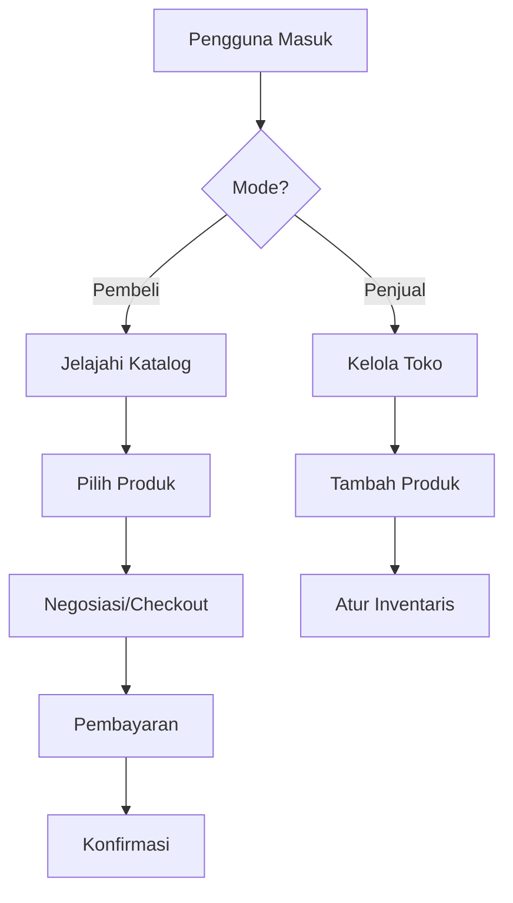

## Modul MARKETPLACE

### 1. Latar Belakang
Platform jual-beli produk/jasa antar anggota komunitas dengan fokus pada produk terkait bidang pendidikan dan pengembangan diri.

### 2. Tujuan
1. Mencapai 500 transaksi bulanan dalam 6 bulan
2. Mempertahankan rating kepuasan > 4.5/5
3. Mengurangi waktu proses transaksi rata-rata menjadi < 24 jam

### 3. Fitur Utama
- Katalog produk/jasa
- Sistem penawaran dan negoisasi
- Pembayaran terintegrasi
- Ulasan dan rating
- Manajemen inventaris
- Sistem rekomendasi

### 4. User Flow

### 5. Requirements
**Functional:**
- Integrasi gateway pembayaran
- Sistem komisi transaksi
- Manajemen pesanan otomatis
- Proteksi pembeli/penjual

**Non-functional:**
- PCI DSS compliance
- Backup data transaksi harian
- Load balancing untuk traffic tinggi

### 6. Metrik Sukses
- Volume transaksi bulanan
- Nilai transaksi rata-rata
- Tingkat konversi kunjungan ke transaksi
- Persentase transaksi berulang