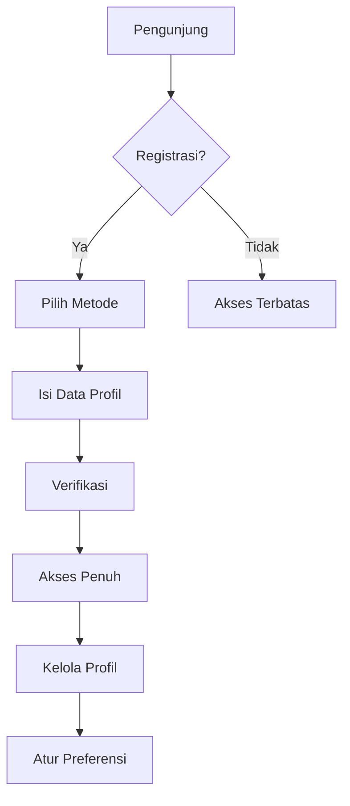

## Modul USER

### 1. Latar Belakang
Manajemen identitas dan preferensi pengguna sebagai dasar personalisasi pengalaman di seluruh platform.

### 2. Tujuan
1. Mencapai 90% kelengkapan profil dalam 1 bulan
2. Mengurangi waktu registrasi menjadi < 1 menit
3. Meningkatkan konversi registrasi sebesar 25%

### 3. Fitur Utama
- Registrasi multi-metode
- Profil pengguna lengkap
- Sistem reputasi dan poin
- Notifikasi terpusat
- Manajemen privasi
- Koneksi jejaring

### 4. User Flow

### 5. Requirements
**Functional:**
- Single Sign-On (SSO)
- Verifikasi 2 faktor
- Role-based access control
- Sistem recovery akun

**Non-functional:**
- Otentikasi OAuth 2.0
- Enkripsi data sensitif
- Audit log akses

### 6. Metrik Sukses
- Tingkat penyelesaian registrasi
- Jumlah aktivitas per pengguna
- Tingkat retensi pengguna bulanan
- Skor NPS (Net Promoter Score)