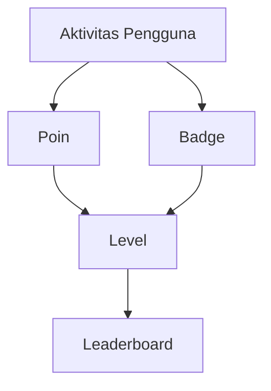

# Perencanaan Fitur Profile dengan Gamifikasi

## Tujuan Fitur
1. Meningkatkan engagement pengguna melalui sistem reward
2. Memberikan visualisasi progres belajar pengguna
3. Membangun komunitas yang kompetitif namun sehat
4. Mendorong partisipasi aktif di semua fitur platform

## Komponen Gamifikasi

### Poin
- **Sumber poin**:
  - Menyelesaikan modul kursus (+100 poin)
  - Berpartisipasi di forum (+20 poin/post)
  - Transaksi marketplace (+50 poin/transaksi)
  - Ulasan produk (+30 poin/ulasan)

### Badge
- **Jenis badge**:
  - Pemula (level 1-5)
  - Enthusiast (level 6-15)
  - Connoisseur (level 16-30)
  - Master (level 31+)
  - Badge spesialis (e.g., "Ahli Citrus", "Raja Woody")

### Level
- **Progres level**:
  - Level 1: 0-100 poin
  - Level 2: 101-250 poin
  - Level 3: 251-500 poin
  - (Skala eksponensial)

### Leaderboard
- **Kategori**:
  - Global (semua pengguna)
  - Bulanan (reset tiap bulan)
  - Berdasarkan minat (e.g., kategori parfum)

## Wireframe Konseptual
1. **Header Profil**:
   - Avatar pengguna
   - Nama dan level
   - Progress bar menuju level berikutnya

2. **Statistik**:
   - Total poin
   - Jumlah badge
   - Peringkat leaderboard

3. **Badge Collection**:
   - Grid badge yang sudah diperoleh
   - Preview badge yang bisa diunlock

4. **Aktivitas Terkini**:
   - Histori perolehan poin
   - Pencapaian terbaru

## Dependensi Teknis
1. **Backend**:
   - Convex function untuk menghitung poin
   - Database schema untuk menyimpan:
     - `user_points` (userId, activityType, points, timestamp)
     - `user_badges` (userId, badgeId, earnedAt)
     - `user_levels` (userId, level, achievedAt)

2. **Frontend**:
   - Komponen `UserStats` yang sudah ada (`src/tempobook/dynamic/src/components/UserStats`)
   - Integrasi dengan Clerk untuk user data
   - Halaman profil baru di `src/pages/profile`

3. **Integrasi**:
   - Sistem notifikasi untuk achievement unlocked
   - Update real-time menggunakan Convex subscriptions

## Timeline Implementasi
1. Minggu 1:
   - Desain database schema
   - Implementasi Convex functions untuk tracking poin
   - Modifikasi komponen UserStats

2. Minggu 2:
   - Implementasi halaman profil lengkap
   - Sistem badge awarding
   - Leaderboard global

3. Minggu 3:
   - Leaderboard bulanan dan kategori
   - Testing dan optimasi performa
   - Deployment fase pertama

## Risiko dan Mitigasi
1. **Performance issue** pada leaderboard:
   - Paginasi data
   - Caching hasil perhitungan

2. **Game imbalance**:
   - A/B testing reward system
   - Mekanisme penyesuaian dinamis