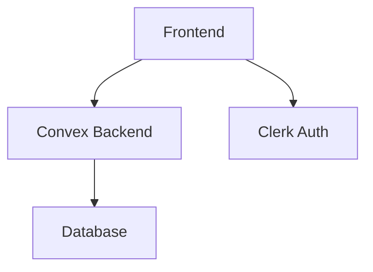

# System Patterns

## Arsitektur Sistem
- Frontend: Next.js dengan TypeScript
- Backend: Convex untuk real-time data
- Database: Convex internal storage
- Autentikasi: Clerk

## Pola Desain Utama
1. **Component-Based Architecture**: Menggunakan komponen modular dari shadcn/ui
2. **Real-Time Updates**: Implementasi Convex untuk sinkronisasi data real-time
3. **Protected Routes**: Sistem proteksi rute berdasarkan role pengguna

## Hubungan Komponen

## Jalur Implementasi Kritis
1. Autentikasi pengguna melalui Clerk
2. Sinkronisasi data real-time dengan Convex
3. Manajemen state global dengan Convex